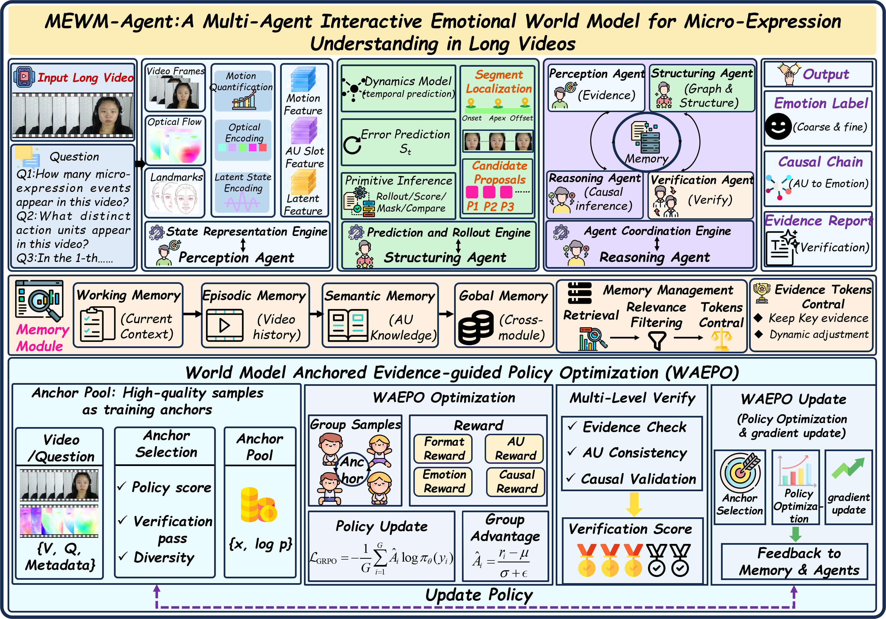
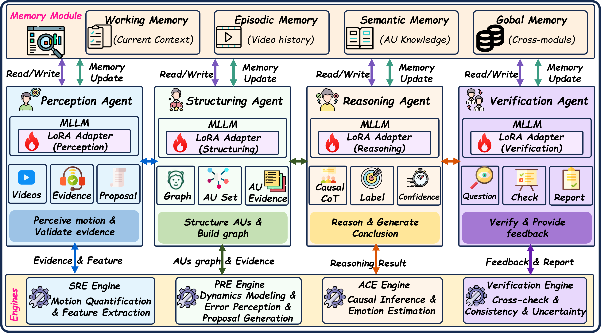
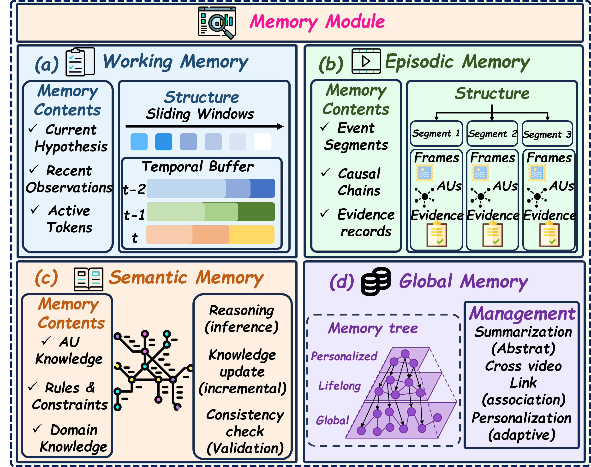
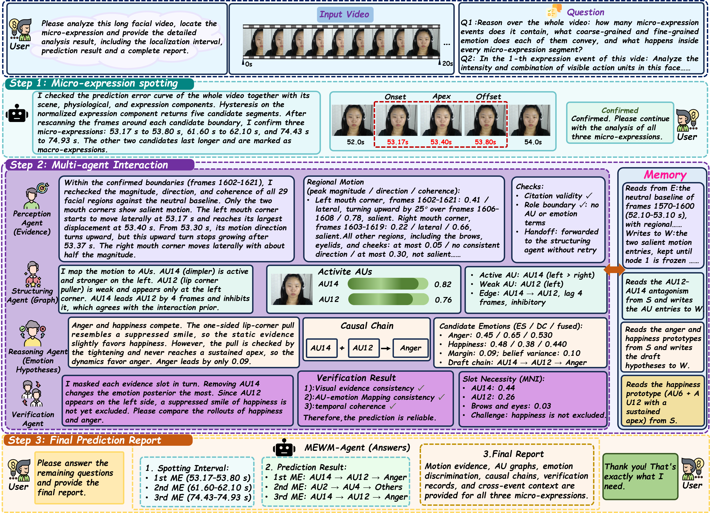

<div align="center">

# MEWM-Agent

### Long-video micro-expression question answering (ME-LVQA)

**Multi-agent interactive emotional world model for long-video micro-expression question answering**

<p>
  <a href="#why-mewm-agent">🔍 Why MEWM-Agent</a>
  &nbsp;&nbsp;·&nbsp;&nbsp;
  <a href="#mewm-agent-in-one-run">🧠 Method</a>
  &nbsp;&nbsp;·&nbsp;&nbsp;
  <a href="#models">🤖 Models</a>
  &nbsp;&nbsp;·&nbsp;&nbsp;
  <a href="#repository-layout">📁 Repository Layout</a>
</p>
<p>
  <a href="#1-install">⚙️ Install</a>
  &nbsp;&nbsp;·&nbsp;&nbsp;
  <a href="#4-run">🚀 Run</a>
  &nbsp;&nbsp;·&nbsp;&nbsp;
  <a href="#5-training">🏋️ Training</a>
  &nbsp;&nbsp;·&nbsp;&nbsp;
  <a href="LICENSE">⚖️ License</a>
</p>

<p align="center">
  <a href="https://www.python.org/"></a>
  <a href="https://pytorch.org/"></a>
  <a href="LICENSE"></a>
</p>

<p align="center">
  
</p>

Overall architecture of MEWM-Agent. **Top:** the State Representation Engine (SRE), the Prediction and Rollout Engine (PRE), and the Agent Coordination Engine (ACE) process a long video, with ACE coordinating four agents over shared memory to produce emotion labels, AU→emotion causal chains, and verified evidence reports. **Middle:** Four-layer memory is retrieved, filtered, and token-regulated before injection into each agent's context. **Bottom:** WAEPO mixes verified anchor trajectories with current policy samples and updates the policy with cascaded rewards.

</div>

## Why MEWM-Agent

Long-video micro-expression question answering (ME-LVQA) requires spotting brief and subtle micro-expressions (MEs) across thousands to tens of thousands of frames, attributing them to facial action units (AUs), and generating a global emotional narrative. Existing methods seldom model subject-specific normal facial dynamics, so they struggle to separate expression displacement from head motion and eye blinks, and cannot maintain cross-segment emotional baselines or verifiable AU-to-emotion evidence chains.

MEWM-Agent closes the loop around state representation, dynamics prediction, evidence reasoning, policy learning, and long-range memory. The main contributions are:

- **AU-centered dual-timescale world-model state space:** a unified state space in which AU-centered dual-timescale states connect the representation of SRE, the subject-specific dynamics prediction of PRE, and the multi-agent coordination of ACE. Prediction deviations and conditional rollouts are exposed to each role as structured evidence entries, supporting progressive reasoning from motion observations to ME understanding, emotion hypotheses, and counterfactual verification.
- **Predictive spotting and counterfactual verification:** ME detection is recast as the identification of structured prediction failures against subject-specific stationary dynamics, and emotion hypotheses are verified through emotion-conditioned trajectory rollouts and counterfactual tests. Insufficient evidence triggers targeted remeasurement or causal revision.
- **World Model Anchored Evidence-guided Policy Optimization (WAEPO):** behavior anchors are built from uniformly verified trajectories, while the advantage baseline is computed exclusively from on-policy samples to avoid advantage inversion; anchor supervision enters through a decoupled likelihood term combined with causal rewards from PRE, so policy updates are jointly constrained by outcome correctness, evidence sufficiency, and causal consistency.
- **Long-range memory and evidence regulation:** four-layer working, episodic, semantic, and global memory with role-specific evidence token regulation maintains out-of-segment baselines and traces evidence provenance. Visibility projection enforces role isolation and supports suppression and masking judgments that depend on long-range context.

MEWM-Agent is validated on four long-video benchmarks — CAS(ME)², SAMM, CAS(ME)³, and 4D-ME — across ME spotting, ME understanding, and ME-LVQA.

## MEWM-Agent in One Run

<p align="center">
  
</p>

Each of the four agents is an MLLM with a role-specific LoRA adapter: perception validates motion evidence and proposals, structuring builds AU sets and temporal dynamic graphs, reasoning generates causal CoT and emotion labels, and critic-verification checks hypotheses and returns evidence reports. All agents access shared memory (top) and engine services (bottom) under level-specific visibility.

One MEWM-Agent run turns a long video into verified AU→emotion evidence chains: the State Representation Engine (SRE) compresses frame-wise observations into AU-centered dual-timescale states; the Prediction and Rollout Engine (PRE) generates candidate events from structured prediction deviations under stationary conditions and provides emotion-conditioned trajectory rollouts and counterfactual verification; and the Agent Coordination Engine (ACE) organizes perception, structuring, reasoning, and critic-verification agents that form conclusions progressively along the motion, AU, emotion, and verification hierarchy.

## Four-Layer Memory

<p align="center">
  
</p>

Four-layer memory keeps cross-segment context within a bounded token budget: working, episodic, and semantic stores plus the global memory 𝔾. Evidence trees are retrieved, filtered, and token-regulated before injection into each agent's context, and memory reads and writes are audited during verification.

## End-to-End Case Study

<p align="center">
  
</p>

End-to-end case of MEWM-Agent on a long video. Step 1 detects five candidates from the prediction error and rescans them to confirm three MEs and two MaEs. Step 2 shows the four-agent analysis of the first ME with memory reads and writes. Step 3 reports the final spotting intervals and AU-to-emotion chains for the three MEs.

## Models

MEWM-Agent runs on both hosted API models and open-weight local models. The policy backbone is configured in `configs/mewm_agent.yaml` under `llm.reasoning_model`.

### API-hosted Models

| Provider | Model | Config key | Notes |
| --- | --- | --- | --- |
| OpenAI | GPT-4o | `gpt-4o` | strong vision reasoning |
| OpenAI | GPT-4o-mini | `gpt-4o-mini` | lighter, lower cost |
| Google | Gemini-2.5-Flash | `gemini-2.5-flash` | fast multimodal |
| Google | Gemini-2.5-Pro | `gemini-2.5-pro` | highest Gemini 2.5 quality |
| Google | Gemini-3-Flash | `gemini-3-flash` | fast Gemini 3 tier |
| Google | Gemini-3-Pro | `gemini-3-pro` | highest Gemini 3 quality |
| Anthropic | Claude-Sonnet-4.5 | `claude-sonnet-4-5` | balanced reasoning and speed |

### Open-weight Local Models

| Model | Config key | Directory under `Weights/` |
| --- | --- | --- |
| Qwen2.5-VL-7B-Instruct | `Qwen2.5-VL-7B` | `Qwen2.5-VL-7B-Instruct/` |
| Qwen2.5-VL-32B-Instruct | `Qwen2.5-VL-32B` | `Qwen2.5-VL-32B-Instruct/` |
| Qwen2.5-Omni-7B | `Qwen2.5-Omni-7B` | `Qwen2.5-Omni-7B/` |
| Qwen3-VL-30B-A3B-Instruct | `Qwen3-VL-30B-A3B` | `Qwen3-VL-30B-A3B-Instruct/` *(default)* |
| Qwen3-VL-8B-Instruct | `Qwen3-VL-8B` | `Qwen3-VL-8B-Instruct/` |
| Qwen3-VL-30B-Instruct | `Qwen3-VL-30B` | `Qwen3-VL-30B-Instruct/` |
| GLM-4.1V-9B-Thinking | `GLM-4.1V-9B` | `GLM-4.1V-9B-Thinking/` |

### Switching Backbones

Switch the backbone without retraining by setting `llm.reasoning_model` in `configs/mewm_agent.yaml` or via the environment variable override:

```bash
set MEWM_LLM__REASONING_MODEL=Qwen3-VL-30B-A3B
python -m mewm.cli.main run --video path/to/video --dataset casme_sq
```

## Hardware Requirements

The default backbone, Qwen3-VL-30B-A3B-Instruct, is a 30B MoE model. The recommended setup is **two NVIDIA RTX Pro 6000 GPUs (96 GB VRAM each, 192 GB total)**, which gives enough headroom to run all four agents simultaneously with full-precision activations across long video sequences.

| Setup | VRAM | Notes |
| --- | --- | --- |
| 2× RTX Pro 6000 (96 GB each) | 192 GB | **recommended** — runs Qwen3-VL-30B-A3B at full precision |
| 2× A100 80 GB | 160 GB | alternative data-center option |

For lighter hardware, switch to a smaller local backbone or use an API-hosted model instead:

```bash
# lighter local model
set MEWM_LLM__REASONING_MODEL=Qwen3-VL-8B
# or skip local GPU requirements entirely with an API backend
set MEWM_LLM__REASONING_MODEL=gemini-3-pro
```

## Datasets & Protocols

| Name | Dataset | Official page | Access |
| --- | --- | --- | --- |
| `casme_sq` | CAS(ME)² | <http://casme.psych.ac.cn/casme/e2> | license agreement, submitted on the site |
| `samm` | SAMM | <http://www2.docm.mmu.ac.uk/STAFF/M.Yap/dataset.php> | license agreement, email `M.Yap@mmu.ac.uk` |
| `casme3` | CAS(ME)³ | <http://casme.psych.ac.cn/casme/e4> | license agreement, submitted on the site |
| `4dme` | 4D-ME | https://ieeexplore.ieee.org/document/9796028 | request via the dataset authors |

All datasets are gated academic benchmarks. Each requires signing the hosting institution's license agreement before raw videos are released.

Two evaluation protocols are implemented in `mewm/training/loso.py` and `mewm/training/lodo.py` and selected with `--protocol`:

- **loso** — leave-one-subject-out within a single dataset
- **lodo** — leave-one-dataset-out cross-corpus generalization

Place raw datasets under `dataset/<name>/` or set the `MEWM_DATASET_ROOT` environment variable.

## 1. Install

The project is developed and tested on **Ubuntu 22.04** with CUDA 12.8.

```bash
pip install -r requirements.txt
```

Core dependencies: `torch 2.7.1+cu128`, `transformers 4.55.0`, `numpy 1.26.4`.

```bash
pip install bitsandbytes>=0.43
```

Then add `load_in_4bit: true` under `llm` in `configs/mewm_agent.yaml` before running.

## 2. Model Weights

Open-weight models are placed under `Weights/`. API-only models need no local files.

| Model | Directory | Notes |
| --- | --- | --- |
| Qwen3-VL-30B-A3B-Instruct | `Weights/Qwen3-VL-30B-A3B-Instruct/` | **default policy** |
| Qwen3-VL-8B-Instruct | `Weights/Qwen3-VL-8B-Instruct/` | lighter local policy |
| Qwen3-VL-30B-Instruct | `Weights/Qwen3-VL-30B-Instruct/` | larger local policy |
| Qwen2.5-VL-7B-Instruct | `Weights/Qwen2.5-VL-7B-Instruct/` | alternative policy |
| Qwen2.5-VL-32B-Instruct | `Weights/Qwen2.5-VL-32B-Instruct/` | large alternative policy |
| Qwen2.5-Omni-7B | `Weights/Qwen2.5-Omni-7B/` | omni alternative policy |
| GLM-4.1V-9B-Thinking | `Weights/GLM-4.1V-9B-Thinking/` | alternative policy |

### Third-party Flow Checkpoints

The MEFlowNet optical-flow pipeline under `third_party/` loads two checkpoints that are **not included in this repository**:

| Checkpoint | Expected path | Source |
| --- | --- | --- |
| DepthAnythingV2 (ViT-S) | `third_party/MELLM-main/MELLM_pipeline/thirdparty/DepthAnythingV2/depth_anything_v2/depth_anything_v2_vits.pth` | [Hugging Face](https://huggingface.co/depth-anything/Depth-Anything-V2-Small/resolve/main/depth_anything_v2_vits.pth?download=true) |
| MEFlowNet | `third_party/MELLM-main/MELLM_pipeline/ckpt/meflownet.pth` | see the MELLM repository |

Run `python third_party/MELLM-main/MELLM_pipeline/check_weights.py` to verify that every expected checkpoint is in place.

## 3. API Key Setup

For API-hosted backbones, set the relevant key as an environment variable before running:

```bash
# OpenAI (GPT-4o, GPT-4o-mini)
set OPENAI_API_KEY=sk-...

# Google (Gemini-2.5-Flash/Pro, Gemini-3-Flash/Pro)
set GOOGLE_API_KEY=AIza...

# Anthropic (Claude-Sonnet-4.5)
set ANTHROPIC_API_KEY=sk-ant-...
```

Then point the config at the desired model:

```bash
set MEWM_LLM__REASONING_MODEL=gemini-2.5-pro
python -m mewm.cli.main run --video path/to/video --dataset casme_sq
```

## 4. Run

```bash
# single-video inference
python -m mewm.cli.main run --video path/to/video --dataset casme_sq

# calibrate thresholds on a calibration fold before reporting numbers
python -m mewm.cli.main calibrate --dataset casme_sq

# list available models
python -m mewm.cli.main models

# LOSO sweep over a whole dataset
python scripts/loso_launcher.py --dataset casme_sq
```

Configuration can be overridden via environment variables using the `MEWM_<SECTION>__<FIELD>` pattern:

```bash
set MEWM_LLM__REASONING_MODEL=Qwen3-VL-30B-A3B
python -m mewm.cli.main run --video path/to/video --dataset casme_sq
```

## 5. Training

Training runs three stages: SFT → RFT → WAEPO. All stages are coordinated by `scripts/loso_launcher.py`:

```bash
# full LOSO training + evaluation on CAS(ME)²
python scripts/loso_launcher.py --dataset casme_sq --policy MEWM-Agent
```

Before training, set the key hyperparameters in [configs/mewm_agent.yaml](configs/mewm_agent.yaml): the `training`, `clip`, `reward`, and `spotting` sections all contain values that must be calibrated on a held-out fold. Run `calibrate` first.

## Repository Layout

```
MEWM-Agent-main/
├── F1.png                                # overall architecture figure
├── F2.png                                # agent roles and interactions figure
├── F3.png                                # four-layer memory system figure
├── F4.png                                # end-to-end case study figure
├── README.md                             # this file
├── requirements.txt                      # Python dependencies
│
├── configs/
│   └── mewm_agent.yaml                   # all runtime knobs: model, thresholds,
│                                         #   training stages, reward weights
│
├── scripts/
│   ├── loso_launcher.py                  # launches full LOSO sweep (train+eval)
│   │                                     #   across all subjects for one dataset
│   ├── sft_launcher.py                   # launches supervised fine-tuning stage
│   │                                     #   independently of the full LOSO loop
│   └── pilot_supervised_localiser.py     # standalone pilot for the localiser
│                                         #   supervised pre-training step
│
├── mewm/                                 # main Python package
│   ├── __init__.py                       # package entry, version string
│   ├── config.py                         # all dataclass configs + load_config();
│   │                                     #   single source of truth for settings
│   ├── pipeline.py                       # end-to-end pipeline: SRE → PRE → ACE
│   │                                     #   coordinating engines, agents, memory
│   ├── schemas.py                        # typed dataclasses for inter-agent
│   │                                     #   messages, evidence trees, QA outputs
│   │
│   ├── agents/                           # four role-specific MLLM agents
│   │   ├── __init__.py
│   │   ├── base.py                       # BaseAgent: LoRA loading, memory I/O,
│   │   │                                 #   engine service calls
│   │   ├── perception.py                 # P-agent: ME candidate scan + verify
│   │   ├── structure.py                  # A-agent: AU set + temporal AU graph
│   │   ├── reasoning.py                  # R-agent: causal CoT + emotion label
│   │   ├── critic.py                     # C-agent: hypothesis test + evidence
│   │   │                                 #   report
│   │   └── roles/                        # system-prompt markdown files
│   │       ├── p_agent_scan.md           # P-agent scan-phase role prompt
│   │       ├── p_agent_verify.md         # P-agent verify-phase role prompt
│   │       ├── a_agent_encode.md         # A-agent AU encoding role prompt
│   │       ├── a_agent_graph.md          # A-agent graph-building role prompt
│   │       ├── r_agent_reason.md         # R-agent causal reasoning role prompt
│   │       ├── r_agent_narrate.md        # R-agent narrative generation prompt
│   │       ├── r_agent_adjudicate.md     # R-agent evidence adjudication prompt
│   │       ├── r_agent_respond.md        # R-agent final QA response prompt
│   │       └── c_agent_critic.md         # C-agent critic-verification prompt
│   │
│   ├── engines/                          # world-model representation engines
│   │   ├── __init__.py
│   │   ├── v1_motion.py                  # V1: optical-flow motion representation
│   │   ├── v2_slots.py                   # V2: slot-based AU state representation
│   │   ├── v3_latent.py                  # V3: latent dual-timescale dynamics
│   │   ├── v4_token_regulator.py         # V4: evidence token budget regulator
│   │   ├── m1_dynamics.py                # M1: subject-specific dynamics model
│   │   ├── m2_localiser.py               # M2: ME candidate localiser
│   │   ├── m2_spotting.py                # M2 spotting decoder + NMS
│   │   ├── m3_primitives.py              # M3: counterfactual rollout primitives
│   │   ├── m4_scheduler.py               # M4: agent-call scheduler
│   │   ├── clip_motion_engine.py         # CLIP-based motion feature extractor
│   │   ├── motion_description.py         # natural-language motion description
│   │   └── softnet_spotter.py            # SoftNet lightweight ME spotter
│   │
│   ├── eval/                             # evaluation and diagnostics
│   │   ├── __init__.py
│   │   ├── metrics.py                    # core spotting metrics: F1, IoU, UF1
│   │   ├── megc_metrics.py               # MEGC-protocol-specific metric wrappers
│   │   ├── megc_questions.py             # MEGC QA question templates
│   │   ├── pass_criteria.py              # per-fold pass/fail thresholds
│   │   ├── report.py                     # per-run summary report writer
│   │   ├── subject_report.py             # per-subject breakdown report
│   │   ├── answer_composer.py            # final QA answer composition
│   │   ├── answer_format.py              # QA answer format validators
│   │   ├── graph_analytics.py            # AU-graph structure analytics
│   │   ├── iou_histogram.py              # IoU distribution histogram
│   │   ├── localisation_diagnostics.py   # localiser error diagnostics
│   │   └── rollout_metrics.py            # world-model rollout quality metrics
│   │
│   ├── knowledge/                        # static domain knowledge
│   │   ├── __init__.py
│   │   ├── au_anatomy.py                 # AU-to-muscle-group anatomy map
│   │   └── emotion_prototypes.py         # AU-to-emotion prototype definitions
│   │
│   ├── llm/                              # LLM backend abstraction
│   │   ├── __init__.py
│   │   ├── client.py                     # unified async client for all API
│   │   │                                 #   backends (OpenAI / Google / Anthropic)
│   │   ├── local_models.py               # HuggingFace local model loader
│   │   │                                 #   with LoRA adapter management
│   │   ├── quant.py                      # bitsandbytes 4-bit/8-bit quant helpers
│   │   └── registry.py                   # model-name → backend routing registry
│   │
│   ├── memory/                           # four-layer memory system
│   │   ├── __init__.py
│   │   ├── store.py                      # working / episodic / semantic stores
│   │   │                                 #   with the global memory 𝔾 coordinator
│   │   └── retrieval.py                  # evidence-tree retrieval + token budget
│   │                                     #   filtering
│   │
│   ├── orchestration/                    # ACE state machine + gate logic
│   │   ├── __init__.py
│   │   ├── orchestrator.py               # ACE: coordinates the four agents over
│   │   │                                 #   the evidence hierarchy
│   │   ├── state.py                      # ACE state dataclass + transition rules
│   │   ├── existence_gate.py            # existence gate: filters spurious ME
│   │   │                                 #   candidates before full agent analysis
│   │   └── gates.py                      # general gating predicates
│   │
│   ├── training/                         # training loops and utilities
│   │   ├── __init__.py
│   │   ├── sft.py                        # supervised fine-tuning stage
│   │   ├── grpo.py                       # GRPO / WAEPO policy optimisation
│   │   ├── rewards.py                    # hierarchical process reward functions
│   │   ├── loso.py                       # leave-one-subject-out training loop
│   │   ├── lodo.py                       # leave-one-dataset-out training loop
│   │   ├── mappo.py                      # MAPPO multi-agent baseline trainer
│   │   ├── pretrain.py                   # world-model pre-training stage
│   │   ├── localiser_supervised.py       # supervised localiser pre-training
│   │   ├── clip_localiser.py             # CLIP-based localiser training
│   │   ├── candidate_filter.py           # candidate filtering during training
│   │   ├── api_sampler.py                # API-model trajectory sampler for RFT
│   │   ├── perception_cache.py           # perception feature cache for speed
│   │   ├── checkpoint.py                 # checkpoint save / load utilities
│   │   ├── diagnostics.py                # training-run diagnostic logging
│   │   ├── instruction_set.py            # SFT instruction-tuning data builder
│   │   ├── qa_augment.py                 # QA data augmentation pipeline
│   │   ├── qa_eval.py                    # QA evaluation during training
│   │   ├── qa_sweep.py                   # QA hyperparameter sweep runner
│   │   └── rl_prompts.py                 # RL-stage prompt templates
│   │
│   ├── data/                             # dataset loading and QA
│   │   ├── __init__.py
│   │   ├── datasets.py                   # dataset loaders for casme_sq / samm /
│   │   │                                 #   casme3 / 4dme with LOSO splits
│   │   ├── paths.py                      # dataset root resolution + path helpers
│   │   └── qa_loader.py                  # QA annotation loader + formatter
│   │
│   ├── cli/                              # command-line interface
│   │   ├── __init__.py
│   │   └── main.py                       # entry point: run / calibrate / models
│   │
│   └── qa/
│       └── interrogate.py                # interactive QA interrogation utility
│
├── pre_datasets/                         # preprocessed flow / face-crop data root
│                                         #   (FLOW_ROOT; populated at runtime)
├── Q-T-A/                                # ME-LVQA QA annotation root (QTA_ROOT),
│                                         #   one JSONL per dataset
├── dataset/                              # raw dataset videos (gated benchmarks,
│                                         #   kept local; empty placeholder in git)
├── runs/                                 # pre-computed intermediate outputs
│                                         #   (empty placeholder in git; outputs stay local)
│   └── softnet_features/casme_sq/        # per-clip SoftNet feature arrays (.npz)
│       └── …                             #   one file per subject-clip pair
│   └── softnet_spotter/casme_sq/         # per-fold SoftNet spotter weights (.npz)
│       └── fold_sXX/softnet_spotter.npz  #   one file per LOSO fold
│
├── third_party/MELLM-main/               # MEFlowNet optical-flow pipeline
│   └── MELLM_pipeline/
│       ├── pipeline.py                   # end-to-end MEFlowNet inference pipeline
│       ├── flow_feature.py               # optical-flow feature extraction
│       ├── flow_vis.py                   # flow visualisation utilities
│       ├── roi_combine.py                # ROI combination for facial regions
│       ├── inference_tools.py            # inference helpers (batch, TTA)
│       ├── diagnostic.py                 # pipeline diagnostic scripts
│       ├── config/meflownet.json         # MEFlowNet model configuration
│       ├── model/meflownet.py            # MEFlowNet model definition
│       ├── model/backbone/               # ViT + DepthAnythingV2 backbone modules
│       └── thirdparty/DepthAnythingV2/   # DepthAnythingV2 depth-estimation module
│                                         #   (checkpoint kept local, not in git)
│
├── assets/                               # runtime binary assets (kept local, not in git)
│   └── shape_predictor_68_face_landmarks.dat  # dlib 68-point facial landmark
│                                              #   predictor (required at runtime)
│
└── Weights/                              # local model checkpoints (kept local; empty placeholder in git)
    ├── Qwen3-VL-30B-A3B-Instruct/        # default policy backbone
    ├── Qwen3-VL-8B-Instruct/             # lighter local policy
    ├── Qwen3-VL-30B-Instruct/
    ├── Qwen2.5-VL-7B-Instruct/
    ├── Qwen2.5-VL-32B-Instruct/
    ├── Qwen2.5-Omni-7B/
    └── GLM-4.1V-9B-Thinking/
```

Empty directories (`Weights/`, `dataset/`, `runs/`, `Q-T-A/`, `pre_datasets/`) are kept on GitHub as placeholders via `.gitkeep`; their runtime contents (model checkpoints, raw videos, pre-computed outputs) stay local and are git-ignored.

## Acknowledgements

MEWM-Agent builds on open research and code. We thank the authors and maintainers of:

- **MELLM** — the MEFlowNet optical-flow pipeline vendored under `third_party/MELLM-main/`.
- **[DepthAnythingV2](https://github.com/DepthAnything/Depth-Anything-V2)** — the depth-estimation backbone vendored under `third_party/`.
- **[dlib](http://dlib.net/)** — the 68-point facial landmark predictor used at runtime.
- The **CAS(ME)²**, **SAMM**, **CAS(ME)³**, and **4D-ME** dataset teams for making their gated benchmarks available.

## License

MEWM-Agent source is released under [MIT](LICENSE). Vendored third-party code (`third_party/`), model checkpoints (`Weights/`), and the gated benchmark datasets retain their original licenses; refer to the corresponding upstream projects.
